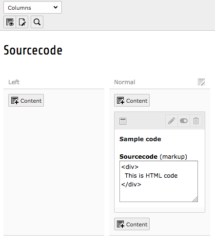

.. ==================================================
.. FOR YOUR INFORMATION
.. --------------------------------------------------
.. -*- coding: utf-8 -*- with BOM.

.. include:: ../Includes.txt

.. _introduction:

Introduction
============

.. _what-it-does:

What does it do?
----------------

This plugin provides state-of-the-art syntax highlighting by using JavaScript 
by using  SyntaxHighlighting 3.x by Alex Gorbatchev or the `prism syntax
highlighter`_ written by Lea Verou.

Use the constant editor or TS to define needed programming languages. These 
will be available in the FE plugin which needs to be added as a generic FE 
plugin (“insert plugin”). Each of this languages is a lazy-loaded (after the 
page has finished loading) Java-Script file. You can define different css 
styles (so called themes) and HTML templates to match your page design.

The following programming languages are available:

SyntaxHighlighter
^^^^^^^^^^^^^^^^^

Actionscript 3, Bash, Shell,  ColdFusion, C, C++, C#, CSS, Delphi, Pas, Pascal,
Diff, Patch, Erlang, Groovy,  Java, Java FX, Java-Script, Perl, PHP, Power-Shell, 
Python, Ruby on Rails, Sass, Scala, SQL, Typoscript, MySQL, Virtual Basic, .Net, XML,
XSLT, XHTML and HTML. 

The newly added TypoScript brush is based upon a `user language for Notepad++ 
<TypoScriptUserLanguageNotepadPP_>`_.

Prism
^^^^^
ActionScript 3, AppleScript, ApacheConf, Bash, C, C-Like, Coffeescript, C++, C#, CSS, Diff, Erlang, Gherkin, Git, Go,
Groovy, HTTP, Java, JavaScript, Less, Markdown, Markup (HTML/XML, etc.), PHP, Power-Shell, Python, Ruby, Sass, Scala,
SCSS, SQL, Twig, TypoScript and Yaml.

.. _features:

Features
--------

- Highlight specific lines
- Show Gutter
- Customizable tab size \*
- Configurable label
- Collapse code \*
- Wrap lines \*
- Preview and t3editor support in BE
- Use HTML templating
- Different visual styles

\* unavailable if using prism

.. _live-demo:

Live Demo
---------

`ext:beautyofcode Live Demo <LiveDemo_>`_

*Please help me to add more sites here:* `contact me <LiveDemoContact_>`_!

SyntaxHighlighter
-----------------

SyntaxHighlighter 3.0 by Alex Gorbatchev, which does the actually 
highlighting, is the nicest syntax highlighter I've seen so far and it's also 
used by Freshbooks, ASP .Net Forums, wordpress.com, Aptana, Mozilla Developer 
Center, SitePoint and Yahoo Developer Network. It is coded in native 
JavaScript and is under active development.

Please see http://alexgorbatchev.com/wiki/SyntaxHighlighter for more information.

Prism
-----

Prism is a lightweight, extensible syntax highlighter, built with modern web 
standards in mind. It's a spin-off from Dabblet and is tested there daily by 
thousands.

See `http://prismjs.com/ <prism syntax highlighter_>`_ for more information.

.. _screenshots:

Screenshots
-----------

See highlighter project website for possible frontend look.

      Content element

	  Content element options tab

      Backend layout

.. _prism syntax highlighter: http://prismjs.com/
.. _SyntaxhighlighterOnlineHelpBrushes: http://alexgorbatchev.com/wiki/SyntaxHighlighter:Brushes
.. _TypoScriptUserLanguageNotepadPP: http://sourceforge.net/tracker/?func=detail&aid=2839067&group_id=95717&atid=612385
.. _LiveDemo: https://www.felixnagel.com/blog/
.. _LiveDemoContact: https://www.felixnagel.com/contact/
.. _LazyLoading: http://en.wikipedia.org/wiki/Lazy_loading
